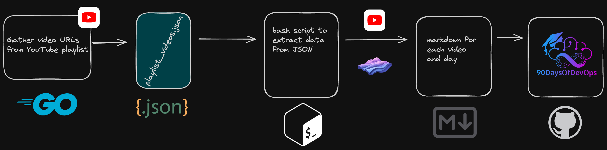

```markdown
# YouTube Playlist Scraper

This Go application fetches all videos from a specified YouTube playlist and exports their titles and URLs to a JSON file named `playlist_videos.json`.

## Prerequisites

- Go (1.15 or later recommended)
- A YouTube API key with access to the YouTube Data API v3
- The ID of the YouTube playlist you wish to scrape

## Setup

1. **Clone the Repository**

   Clone this repository to your local machine using Git:

   ```
   git clone https://github.com/yourusername/youtube_playlist_scraper.git
   ```

2. **Set Environment Variables**

   Set the `YOUTUBE_API_KEY` and `YOUTUBE_PLAYLIST_ID` environment variables. You can do this in your shell or within the application itself.

   For a Unix-like shell, you can export the variables like so:

   ```
   export YOUTUBE_API_KEY='your_youtube_api_key_here'
   export YOUTUBE_PLAYLIST_ID='your_playlist_id_here'
   ```

   Alternatively, you can hardcode them into the `main.go` file, but this is not recommended for security reasons.

3. **Install Dependencies**

   Navigate to the project directory and install the necessary Go dependencies:

   ```
   cd youtube_playlist_scraper
   go get google.golang.org/api/youtube/v3
   go get google.golang.org/api/googleapi/transport
   ```

## Running the Application

To run the application, execute the following command in the terminal from the project directory:

```
go run main.go
```

Upon successful execution, the application will create a `playlist_videos.json` file in the project directory containing the titles and URLs of all videos in the specified YouTube playlist.

## Output Format

The [`playlist_videos.json`](command:_github.copilot.openRelativePath?%5B%7B%22scheme%22%3A%22file%22%2C%22authority%22%3A%22%22%2C%22path%22%3A%22%2FUsers%2Fmichaelcade%2Fyoutube_vid_scraper%2Fplaylist_videos.json%22%2C%22query%22%3A%22%22%2C%22fragment%22%3A%22%22%7D%5D "/Users/michaelcade/youtube_vid_scraper/playlist_videos.json") file will have the following format:

```json
[
  {
    "title": "Video Title 1",
    "url": "https://www.youtube.com/watch?v=video_id_1"
  },
  {
    "title": "Video Title 2",
    "url": "https://www.youtube.com/watch?v=video_id_2"
  }
]
```

## Bloggy 

The bloggy.sh script processes a JSON file containing YouTube video information and generates markdown files with summaries for each video. Here's a step-by-step explanation:

Define the Path to the JSON File: It sets a variable json_file to "playlist_videos.json", indicating the script will read video information from this file.

Read and Parse the JSON File: Using jq, a command-line JSON processor, it extracts each video entry from the JSON file. Each video entry is processed one by one in the subsequent steps.

Iterate Over Each Video: For each video entry, it does the following:

Extracts the video's title and URL using jq.
Uses sed to extract a day number from the video title, assuming the title contains a pattern like "Day X" where X is the day number.
Constructs a markdown file name based on the extracted day number, following the format dayX.md.
Execute Commands for Each Video: It runs placeholder commands (yt and fabric) for each video. These commands are meant to:

Fetch the transcript of the video from its URL (using a hypothetical yt command).
Generate a summary of the transcript using a hypothetical fabric command with specified options (--pattern create_summary --model mistral:instruct).
Append the generated summary to the markdown file named dayX.md.
Final Output: After processing all videos, it prints a message indicating all videos have been processed.

## yt command 

## fabric 

## Process 




## Thumbnails 

You will notice a thumbnails folder this is only here for now to test the outcome, this should not be used by anyone else wanting to achieve this. ß


## License

This project is licensed under the MIT License - see the LICENSE file for details.
```

This README includes comprehensive setup and execution instructions for the YouTube Playlist Scraper application, including a section on automating the process with a bash script.


